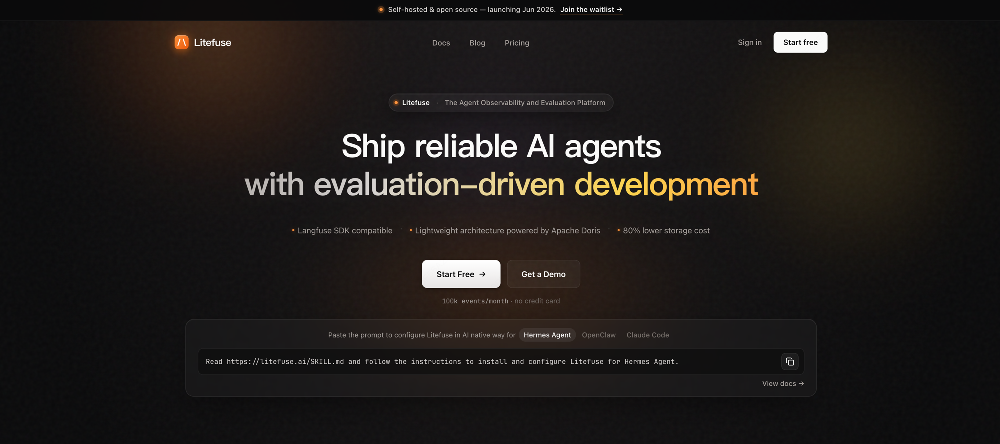
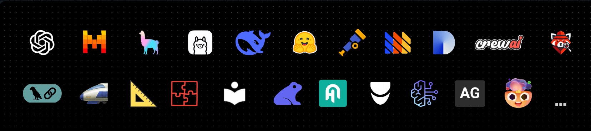

<div align="center">
   <div>
      <h3>
        <a href="https://litefuse.ai/blog/2025-06-04-open-sourcing-litefuse-product">
            <strong>Litefuse Is Doubling Down On Open Source</strong>
         </a> <br> <br>
         <a href="https://cloud.litefuse.ai">
            <strong>Litefuse Cloud</strong>
         </a> · 
         <a href="https://litefuse.ai/self-hosting">
            <strong>Self Host</strong>
         </a> · 
         <a href="https://litefuse.ai/demo">
            <strong>Demo</strong>
         </a>
      </h3>
   </div>

   <div>
      <a href="https://litefuse.ai/docs"><strong>Docs</strong></a> ·
      <a href="https://litefuse.ai/issues"><strong>Report Bug</strong></a> ·
      <a href="https://litefuse.ai/ideas"><strong>Feature Request</strong></a> ·
      <a href="https://litefuse.ai/changelog"><strong>Changelog</strong></a> ·
      <a href="https://litefuse.ai/roadmap"><strong>Roadmap</strong></a> ·
   </div>
   <br/>
   <span>Litefuse uses <a href="https://github.com/orgs/litefuse/discussions"><strong>GitHub Discussions</strong></a>  for Support and Feature Requests.</span>
   <br/>
   <span><b>We're hiring.</b> <a href="https://litefuse.ai/careers"><strong>Join us</strong></a> in product engineering and technical go-to-market roles.</span>
   <br/>
   <br/>
   <div>
   </div>
</div>

<p align="center">
   <a href="https://github.com/selectdb/litefuse-doris/blob/main/LICENSE">
   
   </a>
   <a href="https://www.ycombinator.com/companies/litefuse"></a>
   <a href="https://hub.docker.com/u/litefuse" target="_blank">
   </a>
   <a href="https://pypi.python.org/pypi/litefuse"></a>
   <a href="https://www.npmjs.com/package/langfuse"></a>
   <br/>
   <a href="https://discord.com/invite/7NXusRtqYU" target="_blank">
   </a>
   <a href="https://twitter.com/intent/follow?screen_name=litefuse" target="_blank">
   </a>
   <a href="https://www.linkedin.com/company/litefuse/" target="_blank">
   </a>
   <a href="https://github.com/selectdb/litefuse-doris/graphs/commit-activity" target="_blank">
   </a>
   <a href="https://github.com/selectdb/litefuse-doris/" target="_blank">
   </a>
   <a href="https://github.com/selectdb/litefuse-doris/discussions/" target="_blank">
   </a>
   <a href="https://deepwiki.com/litefuse/litefuse" target="_blank">
   </a>
</p>

<p align="center">
  <a href="./README.md"></a>
  <a href="./README.cn.md"></a>
  <a href="./README.ja.md"></a>
  <a href="./README.kr.md"></a>
</p>

<p align="center">
   <a href="https://github.com/ClickHouse/ClickHouse"><strong>Proudly made with ClickHouse open source database</strong></a>
</p>

Litefuse is an **open source LLM engineering** platform. It helps teams collaboratively
**develop, monitor, evaluate,** and **debug** AI applications. Litefuse can be **self-hosted in minutes** and is **battle-tested**.

## ✨ Core Features


- [LLM Application Observability](https://litefuse.ai/docs/tracing): Instrument your app and start ingesting traces to Litefuse, thereby tracking LLM calls and other relevant logic in your app such as retrieval, embedding, or agent actions. Inspect and debug complex logs and user sessions. Try the interactive [demo](https://litefuse.ai/docs/demo) to see this in action.

- [Prompt Management](https://litefuse.ai/docs/prompt-management/get-started) helps you centrally manage, version control, and collaboratively iterate on your prompts. Thanks to strong caching on server and client side, you can iterate on prompts without adding latency to your application.

- [Evaluations](https://litefuse.ai/docs/evaluation/overview) are key to the LLM application development workflow, and Litefuse adapts to your needs. It supports LLM-as-a-judge, user feedback collection, manual labeling, and custom evaluation pipelines via APIs/SDKs.

- [Datasets](https://litefuse.ai/docs/evaluation/dataset-runs/datasets) enable test sets and benchmarks for evaluating your LLM application. They support continuous improvement, pre-deployment testing, structured experiments, flexible evaluation, and seamless integration with frameworks like LangChain and LlamaIndex.

- [LLM Playground](https://litefuse.ai/docs/playground) is a tool for testing and iterating on your prompts and model configurations, shortening the feedback loop and accelerating development. When you see a bad result in tracing, you can directly jump to the playground to iterate on it.

- [Comprehensive API](https://litefuse.ai/docs/api): Litefuse is frequently used to power bespoke LLMOps workflows while using the building blocks provided by Litefuse via the API. OpenAPI spec, Postman collection, and typed SDKs for Python, JS/TS are available.

## 📦 Deploy Litefuse

Two ways to run Litefuse: use the **managed cloud**, or **self-host** on your own infrastructure (Local, VM, Docker, Kubernetes via Helm, or Terraform on AWS / GCP / Azure).

### Litefuse Cloud

Managed deployment by the Litefuse team, generous free-tier, no credit card required.

<div align="center">
    <a href="https://cloud.litefuse.ai" target="_blank">
        
    </a>
</div>

### Self-Host Litefuse

Run Litefuse on your own infrastructure:

- [Local (docker compose)](https://litefuse.ai/self-hosting/local): Run Litefuse on your own machine in 5 minutes using Docker Compose.

  ```bash
  # Get a copy of the latest Litefuse repository
  git clone https://github.com/litefuse/litefuse.git
  cd litefuse

  # Run the litefuse docker compose
  docker compose up
  ```

- [VM](https://litefuse.ai/self-hosting/docker-compose): Run Litefuse on a single Virtual Machine using Docker Compose.
- [Kubernetes (Helm)](https://litefuse.ai/self-hosting/kubernetes-helm): Run Litefuse on a Kubernetes cluster using Helm. This is the preferred production deployment.
- Terraform Templates: [AWS](https://litefuse.ai/self-hosting/aws), [Azure](https://litefuse.ai/self-hosting/azure), [GCP](https://litefuse.ai/self-hosting/gcp)

See [self-hosting documentation](https://litefuse.ai/self-hosting) to learn more about architecture and configuration options.

## 🔌 Integrations



### Main Integrations:

| Integration                                                                 | Supports                   | Description                                                                                                                                      |
| --------------------------------------------------------------------------- | -------------------------- | ------------------------------------------------------------------------------------------------------------------------------------------------ |
| [SDK](https://litefuse.ai/docs/sdk)                                         | Python, JS/TS              | Manual instrumentation using the SDKs for full flexibility.                                                                                      |
| [OpenAI](https://litefuse.ai/integrations/model-providers/openai-py)        | Python, JS/TS              | Automated instrumentation using drop-in replacement of OpenAI SDK.                                                                               |
| [Langchain](https://litefuse.ai/docs/integrations/langchain)                | Python, JS/TS              | Automated instrumentation by passing callback handler to Langchain application.                                                                  |
| [LlamaIndex](https://litefuse.ai/docs/integrations/llama-index/get-started) | Python                     | Automated instrumentation via LlamaIndex callback system.                                                                                        |
| [Haystack](https://litefuse.ai/docs/integrations/haystack)                  | Python                     | Automated instrumentation via Haystack content tracing system.                                                                                   |
| [LiteLLM](https://litefuse.ai/docs/integrations/litellm)                    | Python, JS/TS (proxy only) | Use any LLM as a drop in replacement for GPT. Use Azure, OpenAI, Cohere, Anthropic, Ollama, VLLM, Sagemaker, HuggingFace, Replicate (100+ LLMs). |
| [Vercel AI SDK](https://litefuse.ai/docs/integrations/vercel-ai-sdk)        | JS/TS                      | TypeScript toolkit designed to help developers build AI-powered applications with React, Next.js, Vue, Svelte, Node.js.                          |
| [Mastra](https://litefuse.ai/docs/integrations/mastra)                      | JS/TS                      | Open source framework for building AI agents and multi-agent systems.                                                                            |
| [API](https://litefuse.ai/docs/api)                                         |                            | Directly call the public API. OpenAPI spec available.                                                                                            |

### Packages integrated with Litefuse:

| Name                                                                   | Type               | Description                                                                                                             |
| ---------------------------------------------------------------------- | ------------------ | ----------------------------------------------------------------------------------------------------------------------- |
| [Instructor](https://litefuse.ai/docs/integrations/instructor)         | Library            | Library to get structured LLM outputs (JSON, Pydantic)                                                                  |
| [DSPy](https://litefuse.ai/docs/integrations/dspy)                     | Library            | Framework that systematically optimizes language model prompts and weights                                              |
| [Mirascope](https://litefuse.ai/docs/integrations/mirascope)           | Library            | Python toolkit for building LLM applications.                                                                           |
| [Ollama](https://litefuse.ai/docs/integrations/ollama)                 | Model (local)      | Easily run open source LLMs on your own machine.                                                                        |
| [Amazon Bedrock](https://litefuse.ai/docs/integrations/amazon-bedrock) | Model              | Run foundation and fine-tuned models on AWS.                                                                            |
| [AutoGen](https://litefuse.ai/docs/integrations/autogen)               | Agent Framework    | Open source LLM platform for building distributed agents.                                                               |
| [Flowise](https://litefuse.ai/docs/integrations/flowise)               | Chat/Agent&nbsp;UI | JS/TS no-code builder for customized LLM flows.                                                                         |
| [Langflow](https://litefuse.ai/docs/integrations/langflow)             | Chat/Agent&nbsp;UI | Python-based UI for LangChain, designed with react-flow to provide an effortless way to experiment and prototype flows. |
| [Dify](https://litefuse.ai/docs/integrations/dify)                     | Chat/Agent&nbsp;UI | Open source LLM app development platform with no-code builder.                                                          |
| [OpenWebUI](https://litefuse.ai/docs/integrations/openwebui)           | Chat/Agent&nbsp;UI | Self-hosted LLM Chat web ui supporting various LLM runners including self-hosted and local models.                      |
| [Promptfoo](https://litefuse.ai/docs/integrations/promptfoo)           | Tool               | Open source LLM testing platform.                                                                                       |
| [LobeChat](https://litefuse.ai/docs/integrations/lobechat)             | Chat/Agent&nbsp;UI | Open source chatbot platform.                                                                                           |
| [Vapi](https://litefuse.ai/docs/integrations/vapi)                     | Platform           | Open source voice AI platform.                                                                                          |
| [Inferable](https://litefuse.ai/docs/integrations/other/inferable)     | Agents             | Open source LLM platform for building distributed agents.                                                               |
| [Gradio](https://litefuse.ai/docs/integrations/other/gradio)           | Chat/Agent&nbsp;UI | Open source Python library to build web interfaces like Chat UI.                                                        |
| [Goose](https://litefuse.ai/docs/integrations/goose)                   | Agents             | Open source LLM platform for building distributed agents.                                                               |
| [smolagents](https://litefuse.ai/docs/integrations/smolagents)         | Agents             | Open source AI agents framework.                                                                                        |
| [CrewAI](https://litefuse.ai/docs/integrations/crewai)                 | Agents             | Multi agent framework for agent collaboration and tool use.                                                             |

## 🚀 Quickstart

Instrument your app and start ingesting traces to Litefuse, thereby tracking LLM calls and other relevant logic in your app such as retrieval, embedding, or agent actions. Inspect and debug complex logs and user sessions.

### 1️⃣ Create new project

1.  [Create Litefuse account](https://cloud.litefuse.ai/auth/sign-up) or [self-host](https://litefuse.ai/self-hosting)
2.  Create a new project
3.  Create new API credentials in the project settings

### 2️⃣ Log your first LLM call

The [`@observe()` decorator](https://litefuse.ai/docs/sdk/python/decorators) makes it easy to trace any Python LLM application. In this quickstart we also use the Litefuse [OpenAI integration](https://litefuse.ai/integrations/model-providers/openai-py) to automatically capture all model parameters.

> [!TIP]
> Not using OpenAI? Visit [our documentation](https://litefuse.ai/docs/get-started#log-your-first-llm-call-to-litefuse) to learn how to log other models and frameworks.

```bash
pip install langfuse openai
```

```bash filename=".env"
LANGFUSE_SECRET_KEY="sk-lf-..."
LANGFUSE_PUBLIC_KEY="pk-lf-..."
LANGFUSE_BASE_URL="https://litefuse.cloud"
```

```python /@observe()/ /from langfuse.openai import openai/ filename="main.py"
from langfuse import observe
from langfuse.openai import openai # OpenAI integration

@observe()
def story():
    return openai.chat.completions.create(
        model="gpt-4o",
        messages=[{"role": "user", "content": "What is Litefuse?"}],
    ).choices[0].message.content

@observe()
def main():
    return story()

main()
```

### 3️⃣ See traces in Litefuse

See your language model calls and other application logic in Litefuse.


_[Public example trace in Litefuse](https://cloud.litefuse.ai/project/cloramnkj0002jz088vzn1ja4/traces/2cec01e3-3dc2-472f-afcf-3b968cf0c1f4?timestamp=2025-02-10T14%3A27%3A30.275Z&observation=cb5ff844-07ef-41e6-b8e2-6c64344bc13b)_

> [!TIP]
>
> [Learn more](https://litefuse.ai/docs/tracing) about tracing in Litefuse or play with the [interactive demo](https://litefuse.ai/docs/demo).

## ⭐️ Star Us

If Litefuse is useful to you, please consider giving the repo a star. It helps more people discover the project and motivates us to keep improving it.

## 💭 Support

Finding an answer to your question:

- Our [documentation](https://litefuse.ai/docs) is the best place to start looking for answers. It is comprehensive, and we invest significant time into maintaining it. You can also suggest edits to the docs via GitHub.
- [Litefuse FAQs](https://litefuse.ai/faq) where the most common questions are answered.
- Use "[Ask AI](https://litefuse.ai/docs/ask-ai)" to get instant answers to your questions.

Support Channels:

- **Ask any question in our [public Q&A](https://github.com/orgs/litefuse/discussions/categories/support) on GitHub Discussions.** Please include as much detail as possible (e.g. code snippets, screenshots, background information) to help us understand your question.
- [Request a feature](https://github.com/orgs/litefuse/discussions/categories/ideas) on GitHub Discussions.
- [Report a Bug](https://github.com/selectdb/litefuse/issues) on GitHub Issues.
- For time-sensitive queries, ping us via the in-app chat widget.

## 🤝 Contributing

Your contributions are welcome!

- Vote on [Ideas](https://github.com/selectdb/litefuse/discussions/categories/ideas) in GitHub Discussions.
- Raise and comment on [Issues](https://github.com/selectdb/litefuse/issues).
- Open a PR - see [CONTRIBUTING.md](CONTRIBUTING.md) for details on how to setup a development environment.

## 🙏 About this fork

> **About this fork** — Litefuse is a fork of [langfuse/langfuse](https://github.com/langfuse/langfuse), and we are deeply grateful to the Langfuse team for the original work. Litefuse swaps the analytics backend to [Apache Doris](https://doris.apache.org/) and maintains wire-protocol compatibility with the upstream Langfuse API, so the official `langfuse` / `@langfuse/*` SDKs and any Langfuse-compatible OpenTelemetry exporter work against Litefuse without code changes — only the host needs to be pointed at your Litefuse endpoint.

## 🥇 License

This repository is MIT licensed. See [LICENSE](LICENSE) for details.

## Dependencies

We deploy this code base in Docker containers based on the Linux Alpine Image ([source](https://github.com/nodejs/docker-node)). You may find the Dockerfiles in [web/Dockerfile](web/Dockerfile) and [worker/Dockerfile](worker/Dockerfile).

## 🔒 Security & Privacy

We take data security and privacy seriously. Please refer to our [Security and Privacy](https://litefuse.ai/security) page for more information.

### Telemetry

By default, Litefuse automatically reports basic usage statistics of self-hosted instances to a centralized server (PostHog).

This helps us to:

1. Understand how Litefuse is used and improve the most relevant features.
2. Track overall usage for internal and external (e.g. fundraising) reporting.

None of the data is shared with third parties and does not include any sensitive information. We want to be super transparent about this and you can find the exact data we collect [here](/web/src/features/telemetry/index.ts).

You can opt-out by setting `TELEMETRY_ENABLED=false`.
