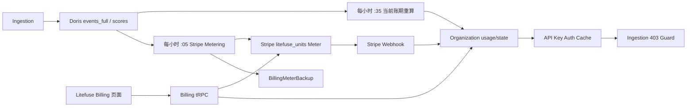

# Litefuse Billing 当前计量计费逻辑

> 基于 `billing` 分支 commit `e580405` 的当前代码梳理。
>
> Litefuse Billing 存在两套相关但不完全一致的账：
>
> - **Litefuse 内部账**：用于 Billing 页面、Developer 额度和 ingestion 阻断，会从 Doris 当前数据重新计算，删除数据后可能下降。
> - **Stripe 计费账**：按小时把原始 units 上报给 Stripe；某小时一旦成功提交，当前代码不会因为后续删除数据而自动冲销。

## 1. 总体数据流



主要入口：

- Billing UI、tRPC 和 Stripe service：`web/src/features/billing/`
- Stripe webhook：`web/src/app/api/billing/stripe-webhook/route.ts`
- Worker 计量和阈值处理：`worker/src/features/billing/`
- Billing 队列：`worker/src/queues/cloudBillingQueues.ts`
- 队列生产者：`packages/shared/src/server/redis/cloudUsageMeteringQueue.ts`、`cloudFreeTierUsageThresholdQueue.ts`
- Billing 聚合查询：`packages/shared/src/server/repositories/billing.ts`
- Billing 数据结构：`packages/shared/prisma/schema.prisma`

## 2. Units 统计口径

当前公式为：

```text
units = traces + observations + scores
```

具体定义：

- `events_full.parent_span_id = ''` 的根事件计 1 个 trace unit。
- `events_full` 中每一行事件计 1 个 observation unit，根事件也包含在内。
- `scores` 中每一行计 1 个 score unit。
- Organization 下所有 `deletedAt = null` 的 Project 汇总并共享额度。
- 使用服务端 `created_at` 归属小时和账期，不使用客户端业务 `timestamp` 或 `start_time`。

因此：

```text
1 个根事件 + 1 个子事件 + 1 个 score
= 1 trace + 2 observations + 1 score
= 4 units
```

相关实现：

- `packages/shared/src/server/repositories/billing.ts`
- `packages/shared/src/server/repositories/traces.ts`
- `packages/shared/src/server/repositories/observations.ts`
- `packages/shared/src/server/repositories/scores.ts`

## 3. Billing 数据结构

Organization 保存：

- `cloudBillingCycleAnchor`
- `cloudBillingCycleUpdatedAt`
- `cloudCurrentCycleUsage`
- `cloudFreeTierUsageThresholdState`
- `cloudConfig`

`cloudConfig` 中 Billing 相关结构：

```text
cloudConfig.plan                           // 人工套餐覆盖
cloudConfig.stripe.customerId
cloudConfig.stripe.activeSubscriptionId
cloudConfig.stripe.activeProductId
cloudConfig.stripe.activeUsageProductId
cloudConfig.stripe.activeTeamsAddonProductId
cloudConfig.stripe.resolvedPlan            // Stripe 解析出的 Pro / Team
cloudConfig.stripe.subscriptionStatus
cloudConfig.stripe.cancelAtPeriodEnd
cloudConfig.stripe.currentPeriodEnd
```

此外还有：

- `BillingMeterBackup`：保存每个 Stripe Customer 每小时的聚合值和提交 checkpoint。
- `StripeWebhookEvent`：保存 webhook payload、处理状态、错误和幂等记录。
- `CronJobs`：保存全局 Stripe usage metering 的小时 checkpoint。

## 4. 账期计算

规则：

- Developer 默认以 Organization 创建日作为月度锚点。
- 付费订阅使用 Stripe subscription `current_period_start`。
- 付费服务结束后使用 subscription period end；缺失时回退当前时间。
- 账期锚点真正改变时清零 `cloudCurrentCycleUsage`。
- 同一账期内重复 subscription 或 invoice webhook 不重复清零。
- 29、30、31 日锚点在短月份调整为当月最后一天。
- 应用会把锚点归一到 UTC 当天 `00:00`，Stripe 原始时分秒不会参与应用账期边界。

实现位于：

```text
packages/shared/src/server/utils/billingCycleHelpers.ts
web/src/features/billing/server/billingService.ts
```

## 5. Stripe Usage Meter 上报

### 5.1 调度

`cloud-usage-metering-queue`：

- 每小时第 5 分钟触发。
- Worker 启动时添加一个 bootstrap job。
- consumer concurrency 为 1。
- BullMQ job 最多尝试 5 次并使用指数退避。
- 单次 Stripe API 调用内部最多重试 3 次。
- 队列注册要求 consumer flag 为 `true` 且存在 `STRIPE_SECRET_KEY`。
- 不要求配置 Cloud Region。

### 5.2 小时处理

Worker 使用 `CronJobs.cloud-usage-metering-hourly`，一次处理一个完整小时 `[start, end)`：

1. 初始 checkpoint 指向上一个完整小时。
2. 小时结束后预留 5 分钟数据落库时间。
3. 使用 30 分钟 processing lease 和数据库 CAS 防止并发处理同一区间。
4. 只处理同时存在以下数据的 Organization：
   - Stripe Customer；
   - active subscription；
   - Stripe resolved plan。
5. 汇总当前未删除 Project 的 trace、observation、score。
6. 零用量不创建 meter event，但仍推进 checkpoint。
7. 非零用量先 upsert `BillingMeterBackup`，再调用 Stripe。
8. 所有 Organization 成功后才推进全局 checkpoint。
9. 如果落后多个小时，会立即追加 job 逐小时追赶。

### 5.3 幂等性

本地 backup 唯一键：

```text
stripeCustomerId + meterId + startTime + endTime
```

Stripe identifier：

```text
litefuse:{orgId}:{intervalStartUnixSeconds}
```

行为：

- `submittedAt != null` 时跳过再次提交。
- 某个 Organization 成功、后续 Organization 失败时，重试会跳过已成功的 backup。
- Stripe 成功但本地 checkpoint 写入失败时，重试仍使用相同 identifier。
- 整个小时没有完整成功前，不推进 `CronJobs.lastRun`。

### 5.4 Stripe payload

应用始终上报原始 units，不预先扣除 Pro 包含的 200,000 units：

```json
{
  "event_name": "litefuse_units",
  "identifier": "litefuse:{orgId}:{intervalStartUnixSeconds}",
  "timestamp": "intervalEndUnixSeconds",
  "payload": {
    "stripe_customer_id": "cus_...",
    "value": "本小时原始 units"
  }
}
```

## 6. 套餐和价格

| 套餐 | 固定月费 | 包含量 | 超额 |
| --- | ---: | ---: | ---: |
| Developer / `cloud:hobby` | $0 | 100,000 | 达到上限后阻断，不产生 usage 费用 |
| Pro | $199 | 200,000 | $0.00004/unit，即额外 100k 为 $4 |
| Teams | Pro + $300 add-on | 继承 Pro | 仅兼容既有订阅，不开放自助购买 |
| Enterprise | 合同 | 合同 | 不走自助 Checkout |

当前自助目标只接受：

```text
targetPlan = "cloud:pro"
```

Pro Checkout 包含两个 line item：

- `STRIPE_PRO_MONTHLY_PRICE_ID`：固定 quantity 1。
- `STRIPE_USAGE_PRICE_ID`：metered price，不传固定 quantity。

`STRIPE_TEAMS_MONTHLY_ADDON_PRICE_ID` 只用于识别既有 Teams 订阅。

应用仅检查 Price ID 是否以 `price_` 开头，不会验证 Stripe Price 的真实金额、计费方式或 tiers。Stripe 中的 Usage Price 应配置为：

- Graduated tiers；
- 0–200,000 units 单价为 0；
- 200,001 以上为 `$0.00004/unit`；
- meter event name 为 `litefuse_units`；
- aggregation 为 Sum。

## 7. 超额计算

Litefuse Billing 页面计算：

```text
overageUnits = max(0, currentUnits - includedUnits)
```

Pro 预计超额：

```text
estimatedOverageUsd = overageUnits × 0.00004
```

例如：

```text
300,000 units
= $199 base + 100,000 × $0.00004
= $203
```

该金额只是税前、折扣前估算。最终金额、税、折扣、优惠券、发票和币种精度由 Stripe 处理。

## 8. Developer 预警和超额阻断

`cloud-free-tier-usage-threshold-queue` 每小时第 35 分钟运行，重新计算每个 Organization 的当前账期用量。

| 当前账期 Units | State |
| ---: | --- |
| 0–79,999 | `null` |
| 80,000–99,999 | `WARNING` |
| ≥100,000 | `BLOCKED` |

### Shadow mode

当：

```text
LITEFUSE_FREE_TIER_USAGE_THRESHOLD_ENFORCEMENT_ENABLED=false
```

系统：

- 更新当前用量；
- 更新最后计算时间；
- state 保持为空；
- 不发邮件；
- 不阻断 ingestion。

### Enforcement mode

启用后：

- 首次进入 WARNING 时向 Organization OWNER、ADMIN 发送预警邮件。
- 首次进入 BLOCKED 时发送阻断邮件。
- 进入或退出 BLOCKED 时清除 Organization API Key 的 Redis 缓存。
- API Key 下次认证时得到 `isIngestionSuspended=true`。
- 受控 ingestion 写入返回 HTTP 403。
- 读取接口、Billing 页面、Stripe Portal 和升级入口仍可使用。

人工非 Hobby 套餐或有效 Stripe 付费订阅不会进入 Developer BLOCKED。

### 当前接入阻断的接口

- `/api/public/ingestion`
- `/api/public/otel/v1/traces`
- `/api/public/scores` 的 v1 POST
- `/api/public/media` 的 POST

### 当前已知未接入

- v2 score POST/PUT
- MCP prompt 等写操作

因此 BLOCKED 不是全系统统一只读锁。

## 9. 套餐解析和 Stripe 订阅状态

### 9.1 套餐优先级

Cloud 环境：

1. `cloudConfig.plan` 人工套餐覆盖优先。
2. 否则要求 Stripe 同时存在 `activeSubscriptionId` 和 `resolvedPlan`。
3. 都没有时为 Developer。

非 Cloud 环境解析为 `oss`。

人工套餐覆盖存在时：

- 禁止 Checkout；
- 禁止自助套餐变更；
- 禁止取消和恢复；
- 禁止创建 Stripe Portal；
- webhook 仍可能更新 `cloudConfig.stripe.*`，但不会覆盖人工套餐字段。

### 9.2 有效付费状态

以下状态保留 Pro/Teams 权益：

- `active`
- `trialing`
- `past_due`

以下状态不视为有效付费：

- `unpaid`
- `canceled`
- `incomplete`
- `incomplete_expired`
- `paused`
- 其他未列入付费状态的值

`past_due` 期间页面显示付款异常提示，但暂时保留付费权益。

### 9.3 Subscription line items 解析

只有 subscription 同时包含当前配置识别出的 Pro Price 和 Usage Price，才解析为 Pro。

在此基础上包含 Teams add-on Price，才解析为 Team。

未知 Price 会被忽略。应用保存的是对应 Product ID：

- `activeProductId`
- `activeUsageProductId`
- `activeTeamsAddonProductId`

## 10. Subscription 生命周期

### Developer → Pro

1. 确认没有人工套餐覆盖和 active subscription。
2. 创建或复用 Stripe Customer。
3. 创建包含 Pro 固定费和 Usage Price 的 Checkout Session。
4. Checkout 返回后等待 Stripe webhook 同步。

### Pro 再选 Pro

返回 no-op，不创建新 subscription 或 schedule。

### 历史 Teams → Pro

创建 Stripe Subscription Schedule：

- 当前 phase 保持原 line items；
- 下个 period 开始使用 Pro + Usage；
- 即账期末移除 Teams add-on。

### 取消

设置：

```text
cancel_at_period_end = true
```

当前账期内继续保留付费权益，账期结束后降为 Developer。

### 恢复

清除：

```text
cancel_at = ""
cancel_at_period_end = false
```

### Keep current plan

- 释放 active/not_started Subscription Schedule。
- 如果还存在待取消状态，同时清除取消标记。

### Stripe Portal

为已有 Customer 创建 Customer Portal Session，用于：

- 付款方式；
- 税务信息；
- 发票；
- Stripe 支持的客户资料。

## 11. Stripe metadata 和区域隔离

Customer metadata：

```text
orgId
cloudRegion
```

Checkout Session metadata：

```text
orgId
userId
targetPlan
cloudRegion
```

Subscription metadata：

```text
orgId
targetPlan
cloudRegion
```

webhook 处理 subscription 时：

- subscription 带有 `cloudRegion`；
- 当前部署也配置了 region；
- 两者不一致；

则忽略该 subscription。

如果 subscription 没有 region，或者当前环境没有 region，则不会因区域被拒绝。

Organization 查找顺序：

1. Subscription metadata `orgId`；
2. `cloudConfig.stripe.customerId`。

## 12. Stripe Webhook

端点：

```text
POST /api/billing/stripe-webhook
```

处理事件：

- `checkout.session.completed`
- `customer.subscription.created`
- `customer.subscription.updated`
- `customer.subscription.deleted`
- `invoice.payment_failed`
- `invoice.paid`

流程：

1. 使用 raw body、`stripe-signature` 和 `STRIPE_WEBHOOK_SECRET` 验签。
2. 以 Stripe event ID 创建 `StripeWebhookEvent`。
3. 首次状态为 `processing`。
4. 已经 `processed` 的事件直接返回 duplicate。
5. `processing` 状态持有 5 分钟 lease。
6. lease 内并发投递不会重复处理。
7. `failed` 或超过 lease 的 processing 事件可以重新 claim。
8. 成功写入 `processed` 和 `processedAt`。
9. 失败写入 `failed` 和错误信息，并返回 500 供 Stripe 重试。
10. 不支持的 event 记录日志后也会标记 processed。

subscription deleted 使用 `forceClear=true`，无论 event object 中的状态如何都清除 active subscription 和 resolved plan。

## 13. Litefuse Billing 页面

入口：

```text
/organization/{orgId}/settings/billing
```

页面展示：

- 当前套餐；
- Stripe subscription status；
- 当前账期 units；
- 套餐包含量；
- 重置日期；
- Pro 预计超额；
- past_due 提示；
- Developer BLOCKED 提示；
- 待取消或待降级；
- 人工套餐覆盖；
- Stripe 未配置或 Price ID 错误；
- Developer、Pro、Enterprise 套餐卡片。

页面操作：

- Upgrade/Switch to Pro；
- Payment methods & invoices；
- Cancel at period end；
- Reactivate subscription；
- Keep current plan；
- Contact sales。

### 页面刷新

- 每 60 秒调用一次 `getBillingStatus`。
- 窗口重新 focus 时立即刷新。
- tab 重新 visible 时立即刷新。
- 从 Stripe Portal 返回时立即刷新。
- Billing usage 有 5 分钟服务端缓存。
- active subscription 存在时，服务端会实时 retrieve Stripe subscription，并修复可能漏掉的 webhook 状态。

### 当前实际权限

普通 Organization 角色中：

- OWNER 拥有 `langfuseCloudBilling:CRUD`。
- ADMIN、MEMBER、VIEWER 当前都没有该 scope。
- 系统级 admin 可以绕过。

但 Developer 阈值通知邮件会发送给 OWNER 和 ADMIN。

## 14. 删除数据后的处理

这是内部账和 Stripe 账最容易产生差异的部分。

| 删除场景 | Litefuse 内部当前用量 | 已上报 Stripe 用量 |
| --- | --- | --- |
| 删除 trace | Doris 删除 trace、关联 observations/scores 后，下次重算下降 | 已提交小时不冲销 |
| 删除单个 score | 下次重算减少相应 score unit | 已提交小时不冲销 |
| 删除 Project | soft delete 后立即从有效 Project 列表排除 | 未处理小时可能不再上报；已提交小时不变 |
| Retention 清理 | Doris 物理删除后，下次重算下降 | 已提交小时不变 |
| 删除 Organization | 先立即取消 Stripe subscription，再删除本地 Organization | 历史 meter events、Customer、invoice 不删除 |

### 14.1 删除发生在 Stripe 上报前

- Stripe metering 查询 Doris 当前结果。
- 已删除的 trace、observation、score 不再被统计。
- Project 一旦 soft delete，即使物理数据尚未删除，也会因为不在有效 Project 列表而被排除。
- backup 已创建但 `submittedAt` 为空时，重跑会 upsert 最新聚合值后提交。

### 14.2 删除发生在 Stripe 上报后

一旦 `BillingMeterBackup.submittedAt` 已写入，当前代码没有：

- meter event adjustment；
- 负数 meter event；
- 自动撤回；
- 自动退款；
- credit note。

删除只会改变 Litefuse 内部当前用量，不会改变 Stripe 已收到的小时用量。

因此可能出现：

```text
Litefuse Billing 页面当前用量 < Stripe 当前账期 meter summary
```

### 14.3 删除后解除 BLOCKED

内部用量下降后：

- Billing 页面缓存过期后可能先显示较低的 current units。
- 页面刷新只更新用量，不更新 `cloudFreeTierUsageThresholdState`。
- 必须等下一次每小时第 35 分钟 threshold job 才重新计算 state。
- BLOCKED 降为 WARNING/null 时会清除 API Key 缓存并恢复受控 ingestion。
- BLOCKED → WARNING 会按当前代码再次发送 WARNING 邮件。

因此可能短暂出现：

```text
页面显示低于 100,000 units，但 ingestion 仍返回 403
```

### 14.4 Project 删除

Project 删除分两步：

1. Web 将 `Project.deletedAt` 设为当前时间并删除 Project API Key。
2. ProjectDeleteQueue 异步删除 Doris、S3、media 和 PostgreSQL 数据。

Billing 的 Project 查询只选择 `deletedAt = null`，因此 soft delete 后就不再计算该 Project，而不是等待物理删除完成。

### 14.5 Retention 清理

Project `retentionDays` 会异步删除：

- `traces`
- `observations`
- `scores`
- `events_full`
- media S3 对象和 PostgreSQL media
- 启用 blob log 时的 ingestion blob 和 Doris 引用

Retention 使用事件业务时间字段作为删除 cutoff，而 Billing 使用服务端 `created_at` 统计。最近创建但业务时间很旧的数据可能被 retention 删除，随后从内部 Billing 重算中消失。

### 14.6 Organization 删除

Organization 删除要求所有 Project 已完成删除，然后：

1. 如果存在 active Stripe subscription，调用 `subscriptions.cancel` 立即取消。
2. Stripe 取消失败时中止 Organization 删除。
3. Stripe 取消成功后删除本地 Organization。
4. 清除 Organization API Key 缓存。

不会自动删除：

- Stripe Customer；
- 历史 meter events；
- 历史 invoice；
- `BillingMeterBackup`；
- `StripeWebhookEvent`。

`BillingMeterBackup.orgId` 没有到 Organization 的外键，因此不会级联删除。

## 15. Project Transfer 的 Billing 影响

Project transfer 只修改 `Project.orgId`，没有 Billing 专用结算或账期拆分。

结果：

- Litefuse 内部当前账期重算时，Project 保留的历史数据会归属到新 Organization。
- 之前已经提交给 Stripe 的小时 units 仍留在旧 Organization 的 Customer。
- 后续尚未处理的小时会按处理时的当前 Project 所属 Organization 上报。
- source/destination Organization 的 cached usage 不会在 transfer 时立即重算。

## 16. Billing 页面与 Stripe 账单的关系

Litefuse Billing 页面负责：

- 套餐和 subscription 状态展示；
- 当前 Doris 用量；
- 包含量；
- 预计超额；
- Checkout、Portal、取消和恢复入口。

Stripe 负责：

- Customer；
- Payment Method；
- Subscription；
- Usage Meter；
- Price tiers；
- 税费；
- 折扣和优惠券；
- 发票；
- 最终应收金额。

Litefuse 不保存完整 invoice 明细，也不使用 Billing 页面估算值覆盖 Stripe 最终结算。

## 17. 环境变量

| 变量 | Web | Worker | 用途 |
| --- | :-: | :-: | --- |
| `STRIPE_SECRET_KEY` | 是 | 是 | Stripe API 和 usage meter 上报 |
| `STRIPE_WEBHOOK_SECRET` | 是 | 否 | Webhook 验签 |
| `STRIPE_PRO_MONTHLY_PRICE_ID` | 是 | 否 | Pro 固定月费 Price |
| `STRIPE_USAGE_PRICE_ID` | 是 | 否 | Usage Price |
| `STRIPE_TEAMS_MONTHLY_ADDON_PRICE_ID` | 是 | 否 | 历史 Teams add-on 兼容 |
| `NEXT_PUBLIC_LITEFUSE_CLOUD_REGION` | 是 | 是 | Cloud 模式和区域信息 |
| `QUEUE_CONSUMER_CLOUD_USAGE_METERING_QUEUE_IS_ENABLED` | 否 | 是 | Stripe metering consumer |
| `QUEUE_CONSUMER_FREE_TIER_USAGE_THRESHOLD_QUEUE_IS_ENABLED` | 否 | 是 | Developer threshold consumer |
| `LITEFUSE_FREE_TIER_USAGE_THRESHOLD_ENFORCEMENT_ENABLED` | 否 | 是 | Shadow/full enforcement |

## 18. 当前实现的重要边界和风险

1. **删除不冲销 Stripe**
   - 已成功提交的 meter event 不会因为后续数据删除而回退。

2. **Project soft delete 立即停止计量**
   - 可能在 Doris 物理删除前就排除整个 Project。

3. **Project transfer 没有账务拆分**
   - 内部账可能重归属，已上报 Stripe 账不会迁移。

4. **订阅状态按处理时判断**
   - Stripe metering 没有检查目标小时与 subscription 生效区间是否重叠。
   - 小时中途升级可能把整小时统计到新订阅。

5. **账期边界精度不一致**
   - Litefuse 使用 UTC 日期，Stripe 使用精确时间。

6. **Self-hosted 没有强制隔离 threshold**
   - 队列注册和 Billing 页面没有硬性要求 Cloud Region。
   - 默认 enforcement 为 false；若 self-hosted 主动开启，普通 Organization 也可能进入 Developer 阻断逻辑。

7. **合同套餐额度没有独立模型**
   - `getBillingStatus` 对任何非 `cloud:hobby` plan 都显示 200,000 included units。

8. **Stripe 配置只验证 Price ID 前缀**
   - 不验证 `$199`、Graduated tiers 或 200k 免费层是否正确。

9. **BLOCKED guard 覆盖不完整**
   - v2 score 和 MCP 写操作仍可能绕过 Developer ingestion suspension。

10. **页面数字和阻断状态可能短暂不一致**
    - 页面用量最多每 5 分钟重算，threshold state 每小时重算。

## 19. 主要代码索引

```text
web/src/features/billing/components/BillingSettings.tsx
web/src/features/billing/server/billingCatalogue.ts
web/src/features/billing/server/billingRouter.ts
web/src/features/billing/server/billingService.ts
web/src/features/billing/server/billingUsageService.ts
web/src/features/billing/server/stripeWebhookHandler.ts
web/src/app/api/billing/stripe-webhook/route.ts

worker/src/features/billing/constants.ts
worker/src/features/billing/usageMetering.ts
worker/src/features/billing/usageThresholds.ts
worker/src/queues/cloudBillingQueues.ts

packages/shared/src/server/repositories/billing.ts
packages/shared/src/server/utils/billingCycleHelpers.ts
packages/shared/src/server/redis/cloudUsageMeteringQueue.ts
packages/shared/src/server/redis/cloudFreeTierUsageThresholdQueue.ts
packages/shared/src/server/queues.ts
packages/shared/prisma/schema.prisma
```

