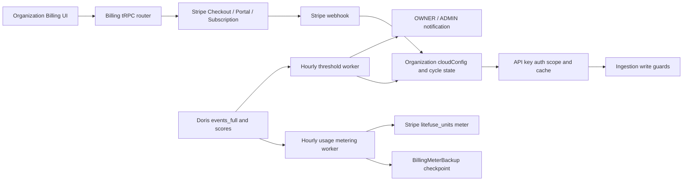

# Billing 技术设计

本文记录 `billing` 分支当前实现，供研发评审、问题定位和 QA 构造测试数据使用。

## 设计边界

- Cloud 按 Organization 计费，所有 Project 汇总到一个账期和 Stripe Customer。
- Self-hosted Open Source 解析为 `oss`，不进入 Stripe Checkout 和 Cloud usage enforcement。
- 当前自助目录只暴露 Pro；Teams 仅用于既有 Stripe add-on 的识别和权益兼容。
- Stripe 负责结算、税费、优惠和发票；应用负责套餐状态、原始用量上报和 Developer 免费额度 enforcement。

## 组件与数据流

主要入口：

- Web UI 与 tRPC：`web/src/features/billing/`
- Stripe webhook：`web/src/app/api/billing/stripe-webhook/route.ts`
- 队列协议与生产者：`packages/shared/src/server/queues.ts`、`packages/shared/src/server/redis/`
- Worker 消费者：`worker/src/features/billing/`、`worker/src/queues/cloudBillingQueues.ts`
- 数据结构：Organization billing 字段、`BillingMeterBackup`、`StripeWebhookEvent`

## 套餐目录与解析

`billingTargetPlanSchema` 当前只允许 `cloud:pro`。Pro 目录必须同时存在以下 Price ID：

- `STRIPE_PRO_MONTHLY_PRICE_ID`：固定费，Checkout quantity 为 1；
- `STRIPE_USAGE_PRICE_ID`：metered line item，不传固定 quantity。

`STRIPE_TEAMS_MONTHLY_ADDON_PRICE_ID` 仍用于 webhook 识别历史 Teams add-on，但不加入自助 catalogue。配置值必须以 `price_` 开头，Product ID 不可替代 Price ID。

组织套餐解析优先级：

1. Cloud 环境中，若 `cloudConfig.plan` 存在，使用人工覆盖；
2. 否则，当 `activeSubscriptionId` 与 `stripe.resolvedPlan` 同时存在时，解析为 Pro 或 Team；
3. 否则解析为 Developer（内部值 `cloud:hobby`）；
4. 非 Cloud 环境解析为 `oss`。

该分离保证 webhook 只更新 `cloudConfig.stripe.*`，不会把 Stripe 结果写入人工覆盖字段。

## Billing tRPC 接口

所有接口都要求 Organization 访问权限 `langfuseCloudBilling:CRUD`。

| 接口                     | 输入                                 | 主要输出/副作用                                                       |
| ------------------------ | ------------------------------------ | --------------------------------------------------------------------- |
| `getBillingStatus`       | `{ orgId }`                          | 套餐、配置问题、Stripe 状态、待生效变更、账期、用量、包含量和预计超额 |
| `createCheckoutSession`  | `{ orgId, targetPlan: "cloud:pro" }` | 创建 Customer（如需要）和 Subscription Checkout，返回 URL             |
| `changePlan`             | `{ orgId, targetPlan: "cloud:pro" }` | Pro 重选为 no-op；已有 Team 则安排账期末切换 Pro                      |
| `cancelSubscription`     | `{ orgId }`                          | 设置 `cancel_at_period_end=true`                                      |
| `reactivateSubscription` | `{ orgId }`                          | 清除账期末取消                                                        |
| `clearScheduledChange`   | `{ orgId }`                          | 释放有效 schedule，并按需清除账期末取消                               |
| `createPortalSession`    | `{ orgId }`                          | 为已有 Stripe Customer 创建 Portal URL                                |

人工套餐覆盖通过 `assertNoManualPlan` 禁止所有自助变更和 Portal。

Checkout、套餐变更、取消、恢复和清除 schedule 会记录组织级审计日志，action 分别为：

- `billing.checkout.create`
- `billing.plan.change`
- `billing.subscription.cancel`
- `billing.subscription.reactivate`
- `billing.schedule.clear`

## Stripe metadata 与 webhook

Customer metadata 写入 `orgId`、`cloudRegion`；Checkout Session 额外写入 `userId`、`targetPlan`；Subscription metadata 写入 `orgId`、`cloudRegion`、`targetPlan`。

Webhook 监听并处理：

- `checkout.session.completed`
- `customer.subscription.created`
- `customer.subscription.updated`
- `customer.subscription.deleted`
- `invoice.payment_failed`
- `invoice.paid`

请求先使用 raw body 和 `STRIPE_WEBHOOK_SECRET` 验签，再以 Stripe event ID 写入 `StripeWebhookEvent`：

- 首次事件创建 `processing` 记录；
- `processed` 事件直接视为 duplicate；
- `failed` 事件可重新 claim；
- `processing` 事件持有 5 分钟 lease，lease 内并发请求不重复处理，超时后允许 reclaim；
- 处理失败写入 `failed` 和错误信息，Stripe 重试可再次处理；
- 处理成功写入 `processed` 与 `processedAt`。

订阅 metadata 中存在 `cloudRegion` 且与当前部署不同，则忽略该订阅。没有通过 metadata 找到 Organization 时，代码可回退使用 Stripe customer ID 匹配。

有效付费状态为 `active`、`trialing`、`past_due`。其他状态不会保留 `resolvedPlan` 和 active subscription 字段。订阅同步后会使 Organization API Key 缓存失效。

## 账期

- Developer 默认使用 Organization `createdAt` 的 UTC 日期作为月度锚点；
- 付费订阅同步时使用 Stripe subscription period start；
- 订阅失效时使用 period end，缺失时回退当前时间；
- 锚点变化时清零 `cloudCurrentCycleUsage`；同一账期重复 webhook 不清零；
- 月末锚点会自动适配短月份，例如 31 日锚定到 2 月最后一天。

当前 `getBillingCycleAnchor` 会把锚点归一到 UTC 当日 00:00。Stripe period start 的具体时分秒不会参与应用账期边界计算，这是 QA 需要覆盖的边界行为。

## Usage Meter 上报

`cloud-usage-metering-queue` 在每小时第 5 分钟触发，并在 Worker 启动时添加 bootstrap job。消费者 concurrency 为 1，单个 job 最多尝试 5 次并使用指数退避。

处理步骤：

1. 使用 `CronJobs` 中的 `cloud-usage-metering-hourly` checkpoint 确定下一个完整小时 `[start, end)`；
2. 通过 30 分钟 processing lease 防止多个 Worker 同时处理同一小时；
3. 查找拥有有效 Stripe Customer、Subscription 和 resolvedPlan 的 Organization；
4. 按 Doris 服务端 `created_at` 分别统计 trace、observation、score，并跨 Organization 的所有未删除 Project 求和；
5. 对非零用量 upsert `BillingMeterBackup`，唯一键为 Customer、meter、start、end；
6. 若 `submittedAt` 为空，向 Stripe meter `litefuse_units` 上报；Stripe API 内部最多重试 3 次；
7. identifier 固定为 `litefuse:{orgId}:{intervalStartSeconds}`；成功后写 `submittedAt`；
8. 推进 CronJobs `lastRun`。若仍落后于当前时间，立即补发下一个 job 继续追赶。

当前计数来自 `events_full` 和 `scores`：根事件同时贡献 trace 计数，全部 event row 贡献 observation 计数，score 独立计数。QA 固定 fixture 的断言为 **4 units**。同一 interval 重跑时，checkpoint 与确定性 identifier 必须保证 Stripe summary 仍为 4。

Usage Price 在 Stripe 配置为 Graduated：前 200,000 免费，之后 `$0.00004/unit`。Worker 始终上报原始值，不扣除包含量。

## Developer 阈值与写入阻断

`cloud-free-tier-usage-threshold-queue` 在每小时第 35 分钟运行，跨 Project 计算每个 Organization 当前账期总量并更新：

- `cloudCurrentCycleUsage`
- `cloudBillingCycleUpdatedAt`
- `cloudFreeTierUsageThresholdState`

状态边界为 79,999 → `null`、80,000 → `WARNING`、99,999 → `WARNING`、100,000 → `BLOCKED`。人工付费套餐或有效 Stripe 付费套餐不会被免费额度阻断。

`LITEFUSE_FREE_TIER_USAGE_THRESHOLD_ENFORCEMENT_ENABLED=false` 时只统计用量，状态保持为空，不发送邮件、不阻断。开启后，状态变化到 WARNING/BLOCKED 时向 OWNER/ADMIN 发信；涉及 BLOCKED 的进入或退出会使 Organization API Key 缓存失效。

API Key scope 的 `isIngestionSuspended` 来自 Organization 的 BLOCKED 状态。当前统一 403 guard 已接入：

- `/api/public/ingestion`
- `/api/public/otel/v1/traces`
- `/api/public/scores` 的 v1 POST
- `/api/public/media` 的 POST

读取接口不执行该 guard。v2 score 和 MCP 写工具当前没有接入此 guard，应作为已知测试缺口记录。

## Data retention

Project 表的 `retentionDays` 是 Data retention management 的配置源，最小有效值为 3 天，`null` 表示不主动清理。

Doris `BatchDataRetentionCleaner` 按每个 Project 的 cutoff 异步删除：

- `traces.timestamp`
- `observations.start_time`
- `scores.timestamp`
- `events_full.start_time`

`MediaRetentionCleaner` 处理 PostgreSQL media 记录和媒体 S3 对象；启用 `LITEFUSE_ENABLE_BLOB_STORAGE_FILE_LOG` 时还删除 ingestion blob，并清理 Doris 引用。各清理器使用 Redis 分布式锁和批量限制协调多 Worker。

套餐 `data-access-days` 是查询访问限制，与物理 retention 删除流程分离：Developer 为 30 天，Pro/Teams 为 1,095 天。

## 配置项

| 变量                                                        | Web | Worker | 用途                          |
| ----------------------------------------------------------- | :-: | :----: | ----------------------------- |
| `STRIPE_SECRET_KEY`                                         | 是  |   是   | Stripe API；Worker meter 上报 |
| `STRIPE_WEBHOOK_SECRET`                                     | 是  |   否   | webhook 验签                  |
| `STRIPE_PRO_MONTHLY_PRICE_ID`                               | 是  |   否   | Pro 固定月费 Price            |
| `STRIPE_USAGE_PRICE_ID`                                     | 是  |   否   | `litefuse_units` Usage Price  |
| `STRIPE_TEAMS_MONTHLY_ADDON_PRICE_ID`                       | 是  |   否   | 既有 Teams add-on 兼容        |
| `NEXT_PUBLIC_LITEFUSE_CLOUD_REGION`                         | 是  |   是   | Cloud 模式与区域隔离          |
| `QUEUE_CONSUMER_CLOUD_USAGE_METERING_QUEUE_IS_ENABLED`      | 否  |   是   | usage meter consumer 开关     |
| `QUEUE_CONSUMER_FREE_TIER_USAGE_THRESHOLD_QUEUE_IS_ENABLED` | 否  |   是   | threshold consumer 开关       |
| `LITEFUSE_FREE_TIER_USAGE_THRESHOLD_ENFORCEMENT_ENABLED`    | 否  |   是   | shadow/full enforcement 开关  |

示例值见 `.env.dev.example`、`.env.prod.example` 和 `.env.test.example`。不要提交真实 Stripe secret 或 webhook secret。
